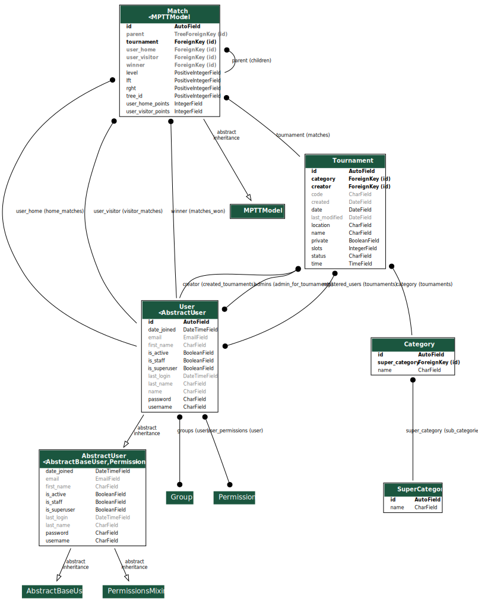

# Tournament Manager

Egill Ragnarsson

Flóki Þorleifsson

Guðmundur Óli Norland

Hjalti Geir Garðarsson

---

## Architecture & Design

---

## Technology

----

## Backend

* Django
  * Backend framework written in python
* GraphQL
  * Open-source data query and manipulation language for APIs.
  * **Graphene:** library for building GraphQL APIs in Python easily
* PostgreSQL
  * Open-source relational database management system. 

----

## Frontend

* React
  * Frontend framework written in javascript
* Apollo Client 
  * A complete state management library for JavaScript apps.

---

## Models

</img>

---

## Key design decisions

* Users manage their own tournaments
* Hands off approach from the web service
* Addition of private and public tournaments

---

## Software Process

----

* The core concept was decided upon pretty early own
* Development started out slow with the set up of our environment

---

## Conclusion

----

## Success

* Clear vision shared among all members of the group
* Good communication
* Clean and modular backend API
* The scope of the project

----

## Failure

* Underestimation of the amount of time it takes to learn new technologies